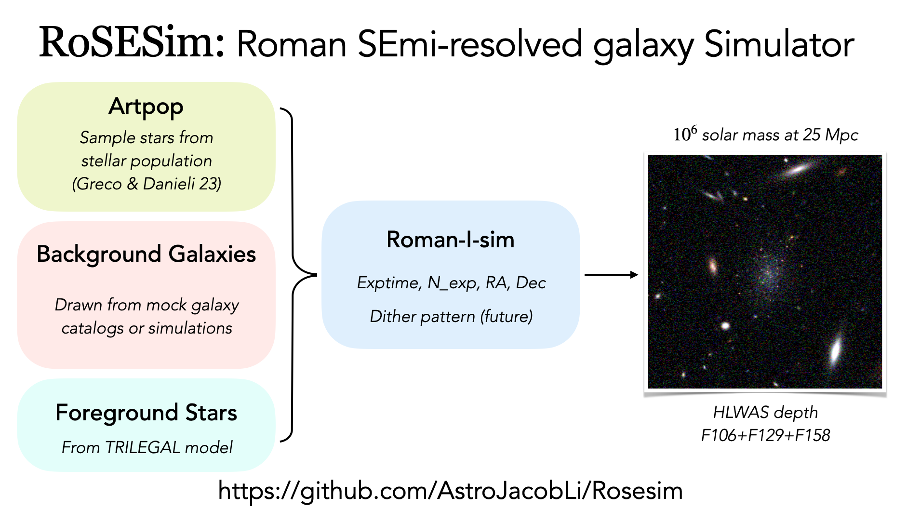

# RoSE-Sim: Roman Semi-resolved Galaxy Simulator
<a href="https://doi.org/10.5281/zenodo.18274779"></a>

**RoSE-Sim** is a Python package designed for creating image simulations of semi-resolved dwarf galaxies for the Nancy Grace Roman Space Telescope.

<!-- insert demo.png  -->


## Citation
If you use `Rosesim` in your work, please cite it:
```tex
@software{jiaxuan_li_2026_18274779,
  author       = {Jiaxuan Li},
  title        = {AstroJacobLi/Rosesim: v1.0},
  month        = jan,
  year         = 2026,
  publisher    = {Zenodo},
  version      = {v1.0},
  doi          = {10.5281/zenodo.18274779},
  url          = {https://doi.org/10.5281/zenodo.18274779},
}
```

## Installation

### 1. Install the Package
You can install **Rosesim** locally by cloning the repository and running:

```bash
git clone git@github.com:AstroJacobLi/Rosesim.git
cd Rosesim
pip install -e .
```

### 2. Set Up Environment Variables
**Rosesim** requires a dedicated data directory to store large files (e.g., isochrones, sky models). 

1. Create a directory for the data (e.g., `/scratch/gpfs/user/Rosesim_Data`).
2. Set the `ROSESIM_DATA_PATH` environment variable pointing to this directory. Add the following line to your shell configuration file (e.g., `~/.bashrc` or `~/.zshrc`):

    ```bash
    export ROSESIM_DATA_PATH="/path/to/your/data/directory"
    ```

3. Reload your shell configuration:
    ```bash
    source ~/.bashrc
    ```

### 3. Download Required Data
Once the package is installed and the environment variable is set, you can easily download the necessary data files using the built-in fetch function:

```python
import rosesim
rosesim.fetch_data()
```
This command downloads the required isochrones and sky models to your `ROSESIM_DATA_PATH`.

## Data Description

### Stellar Population Synthesis Models
**Rosesim** uses [PARSEC isochrones](https://stev.oapd.inaf.it/cgi-bin/cmd) for stellar population synthesis. 

- **Isochrones:** Pre-packaged for Roman filters. Note that Roman isochrones are provided in **Vega** magnitudes.
- **Conversion:** Zeropoint offsets to convert to **AB** magnitudes are available in `rosesim.Roman_zp_AB_Vega_mist`.
- **AGB Stars:** Special attention has been given to the resolution of thermal pulse cycles (`ninTPC=20` in COLIBRI tracks) to strictly resolve AGB stars (see [Lee et al. 2025](https://ui.adsabs.harvard.edu/abs/2025ApJ...995..135L/abstract)).

**Available Grid:** (unfortunately, `artpop` doesn't support the PARSEC isochrones to be interpolated yet)
- **Filters:** F062, F087, F106, F129, F146, F158, F184, F213
- **Log(Age/yr):** [8.0, 8.1, 8.2, 8.3, 8.4, 8.5, 8.6, 8.7, 8.8, 8.9, 9.0, 9.1, 9.2, 9.3, 9.4, 9.5, 9.6, 9.7, 9.8, 9.9, 10.0, 10.1]
- **Metallicity [Fe/H]:** [-2.00, -1.75, -1.50, -1.25, -1.00, -0.75, -0.50, -0.25, 0.00, +0.25]

### Milky Way Star Model
A Milky Way star catalog is generated using the [TRILEGAL](https://stev.oapd.inaf.it/trilegal) model.
- **Default Field:** RA = 10h, Dec = 2.27 deg
- **FoV**: 1 square degrees
- **Depth:** Limiting magnitude of 30 mag in the 4th filter.
- **Location:** Stored in `ROSESIM_DATA_PATH/TRILEGAL/`.

I have also downloaded the TRILEGAL models for NGC 253 (0.7925372h, -25.2888000 deg); Cen A (NGC5128, 13.4246944h, -43.0166667deg).

### Background Sky Model
To simulate realistic observations, `Rosesim` includes a background sky model comprising:
1. **Background Galaxies:** From the [JAGUAR](https://fenrir.as.arizona.edu/jaguar/download_jaguar_files.html) mock catalog.
2. **Foreground Stars:** From the TRILEGAL model.

> [!CAUTION]
> JAGUAR fluxes are currently based on JWST filters, and are converted to Roman filters using simple stellar population models. Also the background galaxies do not have any spatial clustering.

## Usage

### Command Line Interface

**Rosesim** provides command-line scripts for common simulation tasks. The scripts are located in `rosesim/scripts/`.

#### 1. Simulate a Sky Model
Generate a full sky model including background galaxies and Milky Way stars:
```bash
rosesim_sky \
  --obs_ra=150.1049 --obs_dec=2.2741 --size=5001 --prefix='sky_jaguar_trilegal' \
  --exptime=642 --filters="['F106', 'F129', 'F158']" --seed=42 --include_bkg=True --include_star=True \
  --psf_fov_arcsec=10 --trilegal_file="trilegal_Roman_30mag_10h_0deg.dat"
```

For the sky around NGC 253:
```bash
rosesim_sky \
  --obs_ra=11.8880580 --obs_dec=-25.2888000 --size=5001 --prefix='sky_jaguar_trilegal_ngc253' \
  --exptime=642 --nexp=6 --filters="['F106', 'F129', 'F158']" --seed=42 --include_bkg=True --include_star=True \
  --psf_fov_arcsec=10 --trilegal_file="trilegal_Roman_30mag_2deg2_NGC253.dat"
```

```bash
rosesim_sky \
  --obs_ra=11.8880580 --obs_dec=-25.2888000 --size=5001 --prefix='sky_jaguar_trilegal_ngc253' \
  --exptime=5136 --nexp=48 --filters="['F106', 'F129', 'F158']" --seed=42 --include_bkg=True --include_star=True \
  --psf_fov_arcsec=15 --trilegal_file="trilegal_Roman_30mag_2deg2_NGC253.dat"
```

If you wanna exclude large galaxies that have R_e > 0.15 arcsec by using `--exclude_size_thresh=0.15`,
```bash
rosesim_sky \
  --obs_ra=11.8880580 --obs_dec=-25.2888000 --size=5001 --prefix='sky_jaguar_trilegal_ngc253_sizecut' \
  --exptime=642 --filters="['F106', 'F129', 'F158']" --seed=42 --include_bkg=True --include_star=True \
  --psf_fov_arcsec=10 --trilegal_file="trilegal_Roman_30mag_2deg2_NGC253.dat" --exclude_size_thresh=0.15
```


For the sky around Cen A:
```bash
rosesim_sky \
  --obs_ra=201.3704160 --obs_dec=-43.0166667 --size=5001 --prefix='sky_jaguar_trilegal_cena' \
  --exptime=642 --nexp=6 --filters="['F106', 'F129', 'F158']" --seed=42 --include_bkg=True --include_star=True \
  --psf_fov_arcsec=15 --trilegal_file="trilegal_Roman_30mag_2deg2_CenA.dat"
```

```bash
rosesim_sky \
  --obs_ra=201.3704160 --obs_dec=-43.0166667 --size=5001 --prefix='sky_jaguar_trilegal_cena' \
  --exptime=5136 --nexp=48 --filters="['F106', 'F129', 'F158']" --seed=42 --include_bkg=True --include_star=True \
  --psf_fov_arcsec=15 --trilegal_file="trilegal_Roman_30mag_2deg2_CenA.dat"
```


To generate an **empty sky** (for noise-only or background-free simulations):
```bash
rosesim_sky \
  --obs_ra=150.1049 --obs_dec=2.2741 --size=5001 --prefix='empty_sky' --exptime=10272 --filters="['F106', 'F129', 'F158']" --seed=42 --include_bkg=False --include_star=False --psf_fov_arcsec=10
```

Check [this notebook](https://github.com/AstroJacobLi/Rosesim/blob/main/notebook/Rosesim/01_simulate_JAGUAR_sky.ipynb) if you wanna make your own sky model.

#### 2. Simulate a Single Dwarf Galaxy
Inject a specific dwarf galaxy into a simulation:
```bash
rosesim_gal --obs_ra=150.1049 --obs_dec=2.2741 --distance=5 --log_age=9.0 --log_m_star=4 --exptime=642 --sky_model=$ROSESIM_DATA_PATH/empty_sky/
```
You don't need to specify the number of exposures because that is already encoded in the sky model. Make sure that your input RA, Dec matches the sky model.

A full list of options for simulating the dwarf galaxy is as follows:
```python
simulate_galaxy(
    obs_ra=150.1049,
    obs_dec=2.2741,
    log_m_star=6,
    distance=30,
    log_age=9.0,
    feh=-1.5,
    abs_mag_lim=-1,
    filters=["F129", "F158", "F106"],
    exptime=642,
    n=0.8,
    theta=100,
    ellip=0.3,
    sky_model=DATA_PATH + "sky_jaguar_trilegal/",
)
```

Check [this notebook](https://github.com/AstroJacobLi/Rosesim/blob/main/notebook/Rosesim/02_inject_dwarf.ipynb) if you wanna tune your dwarf galaxy's properties, such as size, age, metallicity, etc.

### Python API

You can also use the Python API to inspect or manipulate data.

**Example: inspect the sky model**
```python
import rosesim

# Read the simulated ASDF file
sky_dm = rosesim.read_L3_asdf('./F158_642s.asdf')

# Convert to FITS for inspection (e.g., with DS9)
rosesim.asdf_to_fits(sky_dm, 'F158_642s.fits', subtract_bkg=True)
```

## Requirements
The package relies on the following libraries:
- `numpy`, `matplotlib`, `astropy`, `astroquery`
- `artpop`, `asdf`, `astrocut`, `roman_datamodels`
- `romanisim` (Modified version required: [GitHub](https://github.com/AstroJacobLi/romanisim))

## DOLPHOT tests
Have run DOLPHOT on the following combinations:
- NGC253: 642s and 5136s
- Cen A: 642s and 5136s

## Future Plans
- [ ] Add stellar population info to ASDF `meta`.
- [ ] Support more diverse sky background options.
- [ ] Support composite stellar populations and user-defined structural parameters.
- [ ] Expand documentation and examples.
- [ ] Enable photometry on the simulated images.

## License
MIT
